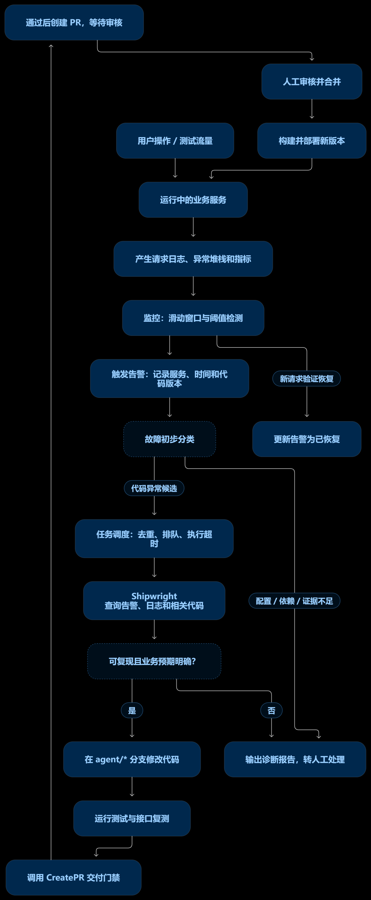

# 本地故障演练场：mewcode-incident-lab

一个**真实运行**的订单服务，故障是预先埋进去的：HTTP 请求、异常堆栈、请求日志、
滑动窗口告警全部由实际运行产生。用来验证一件事：

> 从一条真实告警出发，agent 能不能自己查到根因、改对代码、过门禁、交付。



代码在 [`mewcode-incident-lab/`](mewcode-incident-lab/)，它自己的说明见
[那份 README](mewcode-incident-lab/README.md)。

---

## 一、先说清"真实"和"设计"的边界

这个演练场**不是录播**，也没有预写好的假故障数据。但也不是线上环境的镜像。

| 环节 | 真的 / 设计的 |
|---|---|
| HTTP 请求 | **真**：本地 `127.0.0.1:9080`，脚本发 12 次真实请求 |
| 500 错误 | **真**：真抛 `ZeroDivisionError`，不是写死的响应 |
| 异常堆栈、请求日志 | **真**：服务运行时逐条写 JSONL（`runtime/service.jsonl`） |
| 阈值检测 / 告警去重 / 分类 | **真**：对真实日志行做 60 秒滑动窗口统计 |
| agent 读到的证据 | **真**：`GetAlert` / `QueryLogs` / `QueryMetrics` 走 HTTP 打到 `lab.evidence`，取的就是上面那些日志 |
| agent 的修复、门禁、补丁 | **真**：真改代码、真跑验收、真过独立验证 |
| **故障本身** | **设计的**：bug 是预埋的，客户 1002 故意没有订单 |
| **流量** | **设计的**：`lab.traffic --scenario code` 按剧本发 4 次正常 + 8 次空订单 |
| **监控系统** | **简化的**：单进程本地实现，不是真 Loki / Prometheus / Alertmanager，不支持任意 LogQL / PromQL |
| **部署与工单** | **未接入**：agent 拿不到部署记录；任务正文里明确写了"不能假设没有部署" |

所以它验证"从真实信号出发能不能自己干完"，**不**验证真实 Loki/Prometheus 的字段差异、
真实部署系统、真实 GitHub 那一环。

---

## 二、三个场景

| 场景 | 怎么触发 | 预期分类 | 处理 |
|---|---|---|---|
| **代码缺陷** | 查询没有订单的客户 1002 | `application_candidate`，`code_fix_candidate=true` | 交给 agent 复现 → 修复 |
| **配置错误** | `--database` 指向不存在的文件 | `configuration` | 输出诊断，**不改代码** |
| **依赖故障** | 配送依赖 9081 端口没服务 | `dependency_or_network` | 转人工调查依赖/网络 |

数据：客户 1001 有两笔订单、1003 有一笔、**1002 一笔都没有**。
`/health` 返回 200 时业务接口仍可能 500 —— 演示"进程活着不等于业务正确"。

告警判据（可在命令行覆盖）：**60 秒滑动窗口，≥10 个请求、≥5 个 5xx、错误率 ≥30%，持续 2 秒**。

---

## 三、跑起来之前：两个 Windows 坑（本仓库里的副本已经修好）

这两个坑会让演练场在 Windows 上**永远走不到交付**，而且都不在 agent 的授权修改范围内，
所以必须在基线里就修掉。仓库里的副本已经带修复；如果你是拿原始压缩包，请照做：

**① `with sqlite3.connect(...)` 不关闭连接**

```python
# app/service.py 与 lab/init.py 都有这一行
with sqlite3.connect(path) as conn:   # ← 只 commit/rollback，不关闭！
```

sqlite3 的连接上下文管理器**不负责关闭**。Windows 上文件句柄不释放 →
固定验收里的 `TemporaryDirectory` 清理报 `WinError 32` → `lab.verify` 永远 FAIL。
修法：`with closing(sqlite3.connect(path)) as conn:`（`from contextlib import closing`，
写入路径记得 `conn.commit()`）。

**② `core.autocrlf=true` 会毁掉完整性关卡**

`acceptance/integrity.json` 记录的是 `acceptance/test_regression.py` 与
`docs/API_CONTRACT.md` 的 **sha256（按字节）**。git 在任何**新 clone/checkout** 时
把 LF 转成 CRLF → 哈希对不上 → 验收报 `Fixed evaluator or contract was changed`。
修法：仓库根加 `.gitattributes` 写 `* -text`，并在本地 `git config core.autocrlf false`。

---

## 四、怎么运行

### 前置

```bash
# mewcode 本体（本仓库）
pip install -e .

# 演练场的模型配置：放在用户目录 ~/.mewcode/config.yaml，
# 或演练场目录下的 .mewcode/config.yaml（二选一）
#   只需要 providers 段（protocol / base_url / api_key / model）

cd mewcode-incident-lab
python -m lab.init                    # 建 runtime/ 与订单数据
python -m unittest discover -s tests -v   # 3 个测试应全过
python -m lab.configure --mode patch  # 生成 toolset 覆盖层与收窄后的权限规则
```

`lab.configure` 只写两个文件、**不覆盖已存在的**：`.mewcode/config.local.yaml`
（运维后端 + CreatePR 设置）和 `.mewcode/permissions.local.yaml`
（只允许改 `app/orders.py` 与新增 `tests/test_*.py`）。它不写 provider、不落密钥。

### 方式 A：一键编排（推荐）

5 个进程之间有依赖顺序（服务先起来 → 监控开始统计 → evidence 起来 → 发流量 →
监控写任务 → dispatch 才拿得到任务），手工敲很容易踩"dispatch 早起了看不到任务"。

```powershell
# 在仓库根，一次跑完：起 3 个常驻进程 → 发流量 → 派发 → 收集产物 → 独立验证 → 收尾
python eval/shipwright-triage/run_lab.py runtime-run1
```

它按真实依赖顺序编排，并且额外做了三件**独立**验证：基线必须失败、补丁必须真的改变
文件内容（对账 blob 哈希）、修好的代码必须通过同一条验收命令。

> 脚本里固化了几个坑：端口要**真的试着绑一次**（`netstat` 看不出 `WinError 10013`）；
> 子进程的 `PYTHONPATH` 要指到 **mewcode 包的父目录**（`D:\`），不是仓库目录；
> 每次重跑换新的 `--runtime`，否则监控的去重状态和 dispatch 的任务状态会让第二轮什么都不发生。

### 方式 B：手动 5 个终端

| 终端 | 命令 | 作用 |
|---|---|---|
| 1 | `python -m app.service` | 订单服务（9080） |
| 2 | `python -m lab.monitor` | 读日志、滑窗检测、分类、写任务 |
| 3 | `python -m lab.evidence` | 把日志/告警/指标转成运维工具的响应形状（9082） |
| 4 | `python -m lab.dispatch --execute` | 收到代码故障任务后调用真实 `python -m mewcode -p` |
| 5 | `python -m lab.traffic --scenario code` | 发 12 次真实请求，触发空订单缺陷 |

终端 2 应打印 `application_candidate` / `code_fix_candidate=true`，并生成
`runtime/alerts/*.json` 与 `runtime/tasks/*.md`。

想先人工看一眼任务再执行，就用 `python -m lab.handoff`（只展示）和
`python -m lab.handoff --execute`（真调用）替代终端 4。

### 方式 C：另外两个场景

```bash
# 配置错误：用独立 runtime，避免和上一次的样本混在一起
python -m lab.init --runtime runtime-config
python -m app.service --runtime runtime-config --database runtime-config/not-found.sqlite3
python -m lab.monitor --runtime runtime-config
python -m lab.traffic --scenario config        # 应分类 configuration，不派修复

# 依赖故障：保持 9081 没有服务
python -m lab.init --runtime runtime-dependency
python -m app.service --runtime runtime-dependency
python -m lab.monitor --runtime runtime-dependency
python -m lab.traffic --scenario dependency     # 应分类 dependency_or_network，不派修复
```

---

## 五、门禁是怎么串起来的

```
规范检查 → python -m lab.verify（退出码）→ 独立验证者（只读上下文）→ 提交 → 推送 → PR
```

`lab.verify` 自己包含四道：固定件完整性哈希 → `compileall` → 原有单测 →
固定验收测试。它明确输出 `independent_agent_verification=NOT_RUN`，
**绝不冒充**你的独立模型验证。

固定验收与完整性清单必须对实现者**只读**（现在的权限规则就是这么配的）。
注意 `docs/INTEGRATION.md` 里那句自我提醒：本地哈希只是演示辅助 ——
如果 agent 有任意 shell 写权限，它既能改文件也能改哈希，所以哈希**不能单独充当安全边界**。
真上 CI 时应该把 `acceptance/` 和 API 契约放到实现者写不到的位置。

---

## 六、怎么走到真实 PR

演练场默认 `mode: patch`（只出补丁，不推送）。要真开 PR：

```bash
# 1. 把业务代码推到你自己的 GitHub 仓库（不要混进 mewcode 源码仓库）
cd mewcode-incident-lab
git init -b main && git add -A && git commit -m "Add order service incident lab"
git remote add origin https://github.com/<你>/<仓库>.git
git push -u origin main

# 2. 配好推送与 PR 鉴权：装上 gh 并登录，或 export GITHUB_TOKEN=<repo 权限的 token>

# 3. 改成交付模式 pr（config.local.yaml 里 toolset.create_pr.mode）
python -m lab.configure --mode pr

# 4. 从**保留 bug 的干净基线**重新演示（换新的 --runtime，或换一份干净副本）
```

⚠️ 三个容易踩的点：

- `mode: pr` 但机器上既没有 `gh` 也没有 `GITHUB_TOKEN` 时，**配置校验会在启动时报错** ——
  这是刻意的，避免跑到最后一米才失败。
- `GITHUB_TOKEN` 只用于**开 PR 的 REST 请求**，**不用于 `git push`**。推送走的是 git
  自己的凭据体系，所以光设 token 不够，还得配好凭据（credential manager 或把 token
  拼进远端 URL）。详见本仓库 README 的"验证状态"一节。
- 本机没有远端和鉴权时，只能交付 patch —— **不能称为已提 PR**。

---

## 七、本次实测记录

在 Windows 上完整跑了一遍（真实 LLM，agent 用时 274 秒）：

```
真实请求 → 第 5~12 次请求全部 HTTP 500（ZeroDivisionError）
监控     → classification: application_candidate, code_fix_candidate: true
派发     → python -m mewcode -p <任务>
Agent    → 根因 app/orders.py 的空列表除零
           证据：GetAlert(5xx 66.7%) + QueryLogs(8 条 ZeroDivisionError orders.py:8)
                + QueryMetrics(endpoint 66.67%) + docs/API_CONTRACT.md（空订单应 200 + average_cents:null）
           改 app/orders.py，新增 tests/test_empty_orders.py
           python -m lab.verify → PASS
交付     → CreatePR：命令验证 exit 0（1.6s）+ 独立验证 VERDICT: PASS
产物     → runtime-*/delivery/{changes.patch, pr.json, verification.md}
```

**这次实测也暴露了一个 mewcode 自身的缺陷**，记在这里以免重复踩：
`tools/edit_file.py` 用 `Path.write_text()` 写回文件，在 Windows 上会把**整个文件**的
`\n` 转成 `\r\n`。后果是改一行产生整文件 diff，并且产出的补丁是纯 CRLF，
`git apply` 打不到 LF 仓库上（实测报 `patch does not apply`；把补丁归一化成 LF 后
立即成功、验收通过）。修法是读的时候归一化用于匹配、写回时按**原文件的行尾**还原。
`tools/write_file.py` 大概率是同样的写法。
