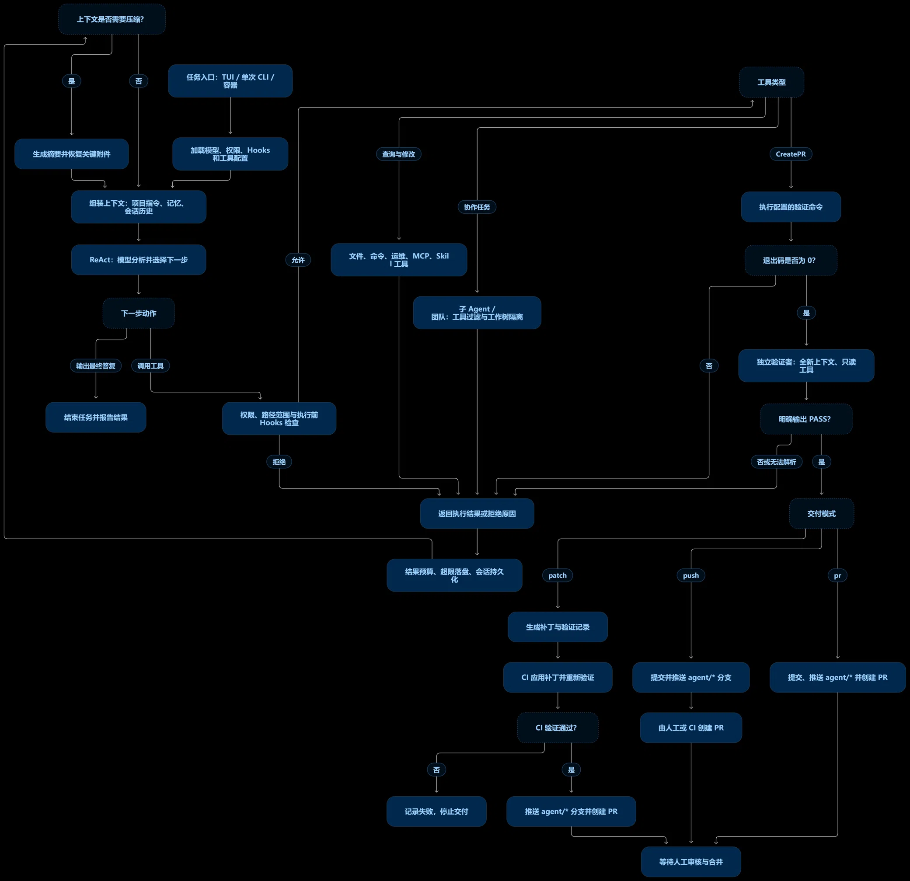

# Shipwright

**一个能自己把活干完的 coding agent**：读代码 → 定位问题 → 改代码 → 跑测试 → 自己验证 → 推 `agent/*` 分支 → 开 PR。

与"让模型自由发挥"的根本区别在于：**边界由机械保证，不靠提示词祈祷。**



---

## 能力一览

| 能力 | 内容 |
|---|---|
| **运行形态** | 交互 TUI（`python -m mewcode`）、单次执行（`-p "任务"`）、容器内、CI 收尾 |
| **工具（38 个）** | 基础 6（读 / 写 / 改 / 执行 / 搜索）；子 agent 与团队 5；任务板 4；工作树 2；技能 2；运维 9；知识库 3；测试环境 4；交付 1 |
| **斜杠命令（14 个）** | `/help` `/compact` `/clear` `/plan` `/session` `/mcp` `/memory` `/permission` `/rewind` `/status` `/skill` `/tasks` `/trace` `/worktree` |
| **权限** | 6 种模式 × read/write/command 三分类；分层检查（Layer 0–5，从 Plan 例外一路到人工确认） |
| **子 agent** | 从 `.md` 定义加载、fork 继承上下文、4 层工具过滤、后台任务、追踪树 |
| **团队模式** | `in-process` / `tmux` / `iterm2` 三种后端；邮箱 + 共享任务 + 每人一个 worktree |
| **记忆** | 用户级 `~/.mewcode/memories.md` + 项目级 `.mewcode/memories.md`；自动提取 + 相关性召回 |
| **上下文管理** | 大工具结果落盘、自动压缩（带断路器）、压缩后回灌关键上下文 |
| **技能** | `SKILL.md`（inline / fork、allowedTools、references 可挂自定义工具），自动变成 `/命令` |
| **扩展接入** | MCP 客户端、插件 entry point、Hooks（15 个事件 × 4 种动作） |
| **交付** | `CreatePR` 三种模式 + 结构性分支护栏 + 独立验证者 + 零 AI 的 CI 收尾 |

---

## 三道机械护栏

### ① 绝不碰基线分支

改动只落在 `agent/<标题>-<sha>` 分支上。

这不是"我们记得别推 `main`"，而是 `delivery.guard_branch` **只放行 `agent/` 前缀** —— 想推基线分支的调用方会发现，那条路根本不存在。

```python
delivery.guard_branch("main", base="main", remote="origin")
# DeliveryError: 拒绝推送受保护的分支名 'main'
delivery.guard_branch("feature/x", base="main", remote="origin")
# DeliveryError: 拒绝推送 'feature/x'：分支名必须以 'agent/' 开头
```

PR 的 `base` 是基线、`head` 是 agent 分支，永远不可能自己合自己。

### ② 自己说"过了"不算数

两层门禁，顺序**硬编码在代码里**：

```
命令验证（退出码）  →  独立验证者（另一个 agent 审）  →  提交  →  推送  →  开 PR
    便宜，先跑              贵，后跑              ↑
                                    验证没过就走不到这里
```

独立验证者的"独立性"同样由机械保证，而不是提示词：

| 维度 | 保证方式 |
|---|---|
| 上下文独立 | 全新 `ConversationManager()`，看不到实现对话 |
| 工具只读 | 注册表里只放 `ReadFile` / `Grep` / `Glob`，**`WriteFile` / `Bash` / `CreatePR` 根本不存在** |
| 权限兜底 | 再加 `PermissionMode.PLAN`，即使注册表被绕过也写不了 |
| 结论必须显式 | 必须输出 `VERDICT: PASS` / `VERDICT: FAIL` |
| **没结论 = 不通过** | 解析不到就按 FAIL 处理（fail-closed） |

它收到的提示词要求的是**找茬**，而不是**确认** —— 当只被要求"确认"时，模型倾向于给出你想要的答案。

### ③ CI 会把它跑过的验证再跑一遍

实现者可能跑错命令、跳过测试，或者改完测试忘了重跑。收尾脚本 `ci/apply_and_open_pr.py` 里**没有一行 AI**，只做四件事：

```
git apply --check  →  独立重跑验证  →  推送  →  开 PR
```

重跑失败会写 `FAILURE.md`，并附上 agent 自己的验证记录 —— 这样人能一眼看出是**「agent 谎报通过」**，还是**「代码真的坏了」**。

---

## 快速开始

```bash
git clone https://github.com/wsxhyit-code/Shipwright.git
cd Shipwright
pip install -e .

cp .mewcode/config.yaml.example .mewcode/config.yaml   # 填你的 provider 与 api_key
python -m mewcode
```

依赖（Python ≥ 3.11）：

```
anthropic>=0.42.0   httpx>=0.27.0     mcp>=1.12.0      openai>=1.60.0
pydantic>=2.0       pyyaml>=6.0       rich>=13.0       textual>=2.1.0
```

开发与测试额外需要 `pytest` + `pytest-asyncio`（`pip install -e ".[dev]"`）。

> **关于目录名**：这个仓库采用"源码根 = 包根"的扁平布局 —— `__init__.py` 就在仓库根，源码里一律写 `from mewcode.tools import ...`，靠 `pyproject.toml` 里的 `package-dir = {"mewcode": "."}` 映射成可安装的包。
>
> 因此：**`pip install -e .` 之后，目录叫什么名字都能用**。但如果不安装、直接 `python -m mewcode`，就要求目录名恰好是 `mewcode` —— 源码运行依赖"父目录在 `sys.path` 上"。
>
> 打包上踩过的坑（`packages.find` 会打坏 wheel）记在
> [`docs/DESIGN-NOTES.md`](docs/DESIGN-NOTES.md#5-打包为什么-pyprojecttoml-刻意不用-packagesfind)。

---

## 配置：怎么把这些能力开起来

内置只有 6 个工具（`ReadFile` / `WriteFile` / `EditFile` / `Bash` / `Glob` / `Grep`）。运维工具和 `CreatePR` 都由配置装配 —— **不写这段，agent 就够不着它们**：

```yaml
toolset:
  # ① 让 agent 具备「提 PR」这个动作
  create_pr:
    enabled: true
    verify_command: "python -m pytest tests/ -q"   # 必填，没有它启动就报错
    artifacts_dir: ".mewcode/pr"
    base_ref: "main"
    require_independent: true                      # 必须配独立验证者，否则拒绝
    timeout: 900

    # 交付模式 —— agent 自己走到哪一步
    mode: pr            # patch（只出补丁）| push（推 agent/* 分支）| pr（再开 PR）
    remote: origin
    api_base: ""        # 留空 = https://api.github.com；自建实例填 https://<host>/api/v3

  # ② 接运维数据源（不写就是没接，调用会明确报错）
  ops:
    - kind: loki
      base_url: "https://loki.internal"
      token_env: "LOKI_READONLY_TOKEN"             # 从环境变量读，配置里不落密钥
    - kind: prometheus
      base_url: "https://prom.internal"
    - kind: alertmanager
      base_url: "https://am.internal"
      token_env: "AM_TOKEN"
```

### 三种交付模式

| mode | agent 走到哪一步 | 需要什么 | 适用 |
|---|---|---|---|
| **`patch`**（默认） | 只产出 `changes.patch` / `pr.json` / `verification.md`，**不推送** | 无 | 容器模式（agent 连不上远端，由 CI 收尾） |
| **`push`** | 再加上：自己提交 → 推 `agent/*` 分支 | 远端 + 推送凭据 | 想让人或 CI 来开 PR |
| **`pr`** | 再加上：直接开 PR | 上面两项 + `gh` 或 `GITHUB_TOKEN` | 完整自治 |

**三种模式的护栏完全一样。** 如果配了 `mode: pr`，但本机既没有 `gh` 也没有 token，配置校验会在**启动时**就报错 —— 不这么做的话，agent 会改完代码、两层验证都通过、分支都推上去之后，才发现开不了 PR。"跑到最后一米才失败"是最浪费的失败方式。

> ⚠️ `GITHUB_TOKEN` **只用于开 PR 的 REST 请求，不用于 `git push`**。推送走 git 自己的凭据体系，所以只设 token 还不够：还要配 credential helper，或把 token 拼进远端 URL / 用 `http.extraheader`。

几条刻意做"严"的校验（`enabled` 却没写 `verify_command`、`token_env` 读不到、能力没接入时报错而不返回空）逐条记在
[`docs/DESIGN-NOTES.md`](docs/DESIGN-NOTES.md#4-为什么没接入的能力要报错而不是返回空)。

---

## 完整流程

```
━━━━━━━━━━━━━━━━━━━━━━━━━━━━━━━━━━━━━━━━━━━━━━━━━━━━━━━━━━━━━━━
【准备】确定性，无 AI
━━━━━━━━━━━━━━━━━━━━━━━━━━━━━━━━━━━━━━━━━━━━━━━━━━━━━━━━━━━━━━━
  docker compose -f docker/compose.test.yml up -d --wait
  docker build -f docker/Dockerfile.agent -t mewcode-agent .

━━━━━━━━━━━━━━━━━━━━━━━━━━━━━━━━━━━━━━━━━━━━━━━━━━━━━━━━━━━━━━━
【AI 内核】唯一需要 LLM 的一段
━━━━━━━━━━━━━━━━━━━━━━━━━━━━━━━━━━━━━━━━━━━━━━━━━━━━━━━━━━━━━━━
  Grep / ReadFile 定位问题
  EditFile 改代码（post_tool_use hook 自动 ruff format）
  Bash: pytest -q
      ↓
  调用 CreatePR
    ├─ ① 命令验证：退出码必须 0
    ├─ ② 独立验证：另一个 agent 审（新上下文 + 只读工具集 + plan 模式）
    └─ ③ 按 mode 交付：出补丁 / 推 agent/* / 开 PR
       ★ 全程没有 git push 到基线分支

━━━━━━━━━━━━━━━━━━━━━━━━━━━━━━━━━━━━━━━━━━━━━━━━━━━━━━━━━━━━━━━
【收尾】确定性，无 AI
━━━━━━━━━━━━━━━━━━━━━━━━━━━━━━━━━━━━━━━━━━━━━━━━━━━━━━━━━━━━━━━
  python ci/apply_and_open_pr.py --repo . --artifacts .mewcode/pr \
      --verify-cmd "pytest -q" --base main
    ├─ git apply --check → git apply      （脏补丁在这里就被拦下）
    ├─ 独立重跑验证                        （不信 agent 自己跑的那次）
    ├─ git checkout -B agent/<slug>-<sha>  （绝不推基线分支）
    ├─ git push -u origin <branch>
    └─ 开 PR（gh 或 REST API）
```

---

## 本地故障演练场：验证"从告警到 PR"的整条链路

上面那条链路需要真实环境才能跑。**`mewcode-incident-lab/` 把它搬到了本机**：一个真实运行的订单服务，故障是预先埋进去的；HTTP 请求、异常堆栈、请求日志、滑动窗口告警全部由实际运行产生，监控则把代码类故障派给真实的 `python -m mewcode -p`。


```bash
pip install -e .                        # 装 mewcode 本体
cd mewcode-incident-lab
python -m lab.init                      # 建 runtime 与订单数据
python -m lab.configure --mode patch    # 生成 toolset 覆盖层 + 收窄后的权限规则
python -m app.service                   # 终端 1：订单服务
python -m lab.monitor                   # 终端 2：滑窗检测与分类
python -m lab.evidence                  # 终端 3：给运维工具提供本地 HTTP 数据
python -m lab.dispatch --execute        # 终端 4：派发给真实 mewcode
python -m lab.traffic --scenario code   # 终端 5：发 12 次请求触发空订单缺陷
```

**完整操作说明、三个场景（代码缺陷 / 配置错误 / 依赖故障）的触发方式、以及走到真实 PR 的步骤，见 [`INCIDENT-LAB.md`](INCIDENT-LAB.md)。**

---

## 容器沙箱：靠"不给"，不是靠"禁止"

| # | 铁律 | 不做会怎样 |
|---|---|---|
| **①** | **绝不挂 `docker.sock`** | agent 能 `docker run --privileged -v /:/host` 拿到宿主 root。**这是业界最常见的沙箱穿透方式** |
| **②** | **绝不挂宿主 `$HOME` / `.ssh` / 云凭证** | 只挂 `/work`（代码）和 `/artifacts`（产物） |
| **③** | **默认禁出网** | 否则 agent 能把代码发出去，也能拉任意代码进来 |

实测（`docker/check-sandbox.sh`，14/14 通过）：

```
  ✅ /root 不可读（当前非 root）      ✅ 不是 root
  ✅ 宿主 ssh 目录不存在               ✅ 没有 docker 命令
  ✅ 宿主 ~/.aws 不存在                ✅ 没有 docker socket
  ✅ 宿主 ~/.mewcode 不存在            ✅ 没有 kubectl
  ✅ HOME 下没有 ssh 私钥              ✅ 没有 ssh 客户端
  ✅ 代码目录可写 / 产物出口可写        ✅ 连不上公网 / DNS 解析不了外网
```

"起测试环境"这件事被分成三层，其中只有两层该给 agent：**依赖服务由平台预先起好**，**项目依赖与测试数据交给 agent**。理由见
[`docs/DESIGN-NOTES.md`](docs/DESIGN-NOTES.md#6-沙箱为什么是不给而不是禁止)。

---

## 除了改代码，它还能做运维

接上 Loki / Prometheus / Alertmanager 之后，它能走完一条完整链路：

```
告警说 5xx 涨了  →  日志聚类指向某个具体位置
                 →  指标显示**只有 pod-3 异常**
                 →  部署记录显示 pod-3 在 12 分钟前更新过
                 →  顺藤摸到这次发布的代码改动（用 coding 工具）
                 →  改完、自己验证过、提 PR
```

**这是普通运维 AI 做不到的** —— 它只能告诉你"pod-3 有问题，建议重启"。

日志聚类在客户端完成：1,204 条日志聚成 1 类，只给「签名 / 条数 / 时间范围 / 样例 3 行」。不聚类的话，就是把 240KB 直接塞进上下文，正好踩上"工具结果超限 → 落盘 → 只给 2KB 预览"那个坑。

---

## 项目结构

```
__main__.py  app.py            入口（TUI 与 -p 两条装配路径）
agent.py                        ReAct 主循环
client.py                       Anthropic / OpenAI / OpenAI-compat 三个客户端
context/manager.py              两层压缩（大工具结果落盘 + 摘要 + 断路器）

tools/                          内置工具 + 扩展工具
  create_pr.py                  CreatePR 门禁（三种交付模式）
  agent_verify.py               独立验证子 agent
  ops/                          9 个运维工具
    backends/                   Loki / Prometheus / Alertmanager 真实实现 + 工厂
  environment/  knowledge/      测试环境编排 / 企业知识库（各自可插拔后端）
delivery.py                     提交 / 推 agent/* / 开 PR（agent 与 CI 共用）
toolset.py                      配置 → 工具装配
permissions/                    Layer 0-5 权限检查 + PathSandbox
hooks/                          事件钩子（15 个事件 × 4 种动作）
skills/  memory/                Skill 系统 / 记忆与会话（JSONL 持久化，无数据库）
mcpclient/                      MCP 客户端
commands/                       斜杠命令注册表与处理器

docker/                         容器沙箱（三条铁律）
ci/                             确定性收尾流水线（无 AI）
docs/devops-agent/              说明 + 可跑 demo
mewcode-incident-lab/           本地故障演练场（见 INCIDENT-LAB.md）
assets/                         README 用图
tests/                          单元与端到端测试
```

### 跑测试

```bash
python -m pytest              # 默认沙箱下会有若干 skip（推送 / 开 PR 相关）
python -m pytest -m llm       # 真实 LLM 测试（要 API key，约 8 分钟）
```

---

## 验证结论

**已端到端实测**（完整记录与逐条验法见 [`docs/VERIFICATION.md`](docs/VERIFICATION.md)）：

- ★ **独立验证者能抓到植入的 bug**：真实 LLM 测试里判 FAIL，且理由**点到了具体符号**（`None` / 判空 / `KeyError`）；反向用例判 PASS —— 它有区分能力，不是"永远 FAIL"
- ★ **验证者物理上改不了文件**：只读注册表 + `plan` 模式
- **门禁拦得住没改好的代码**：代码没修 → 被拒 → **不产出补丁**；且"验证先于交付"的顺序有测试钉住
- ★ **交付链路整条走通**（对着**本地假 GitHub API**）：真 push 到远端 + 真发 `POST /repos/{owner}/{name}/pulls`，**URL / 认证头 / payload 全部核对**；`main` 未被碰
- ★ **本地故障演练场**：12 次真实请求 → 8 个 500 → 滑窗告警分类为代码故障 → **真实 agent 自己定位到 `app/orders.py` 的空列表除零并改对** → 验收通过 → `CreatePR` 命令验证 exit 0 + 独立验证 PASS → 产出补丁
- **沙箱三条铁律**：真实运行标志 + 真实网络实测，自检 14/14

**边界与已知问题**不在这里展开，点链接即可：

| 主题 | 内容 |
|---|---|
| 未验证范围 | 对着**真 GitHub 服务端**开 PR 需要凭据、容器镜像未实际构建、真实 Loki/Prometheus 未对实例验字段名 → [`docs/VERIFICATION.md`](docs/VERIFICATION.md) |
| 已知缺陷 | 含 Windows 下 `EditFile` 会改写整个文件行尾、子 agent 权限取默认值会静默失败 → [`docs/LIMITATIONS.md`](docs/LIMITATIONS.md) |
| 设计取舍 | 为什么允许 agent 自己推送、为什么只信退出码、为什么"没接入"要报错，以及"断言声明 ≠ 断言效果"的几次翻车 → [`docs/DESIGN-NOTES.md`](docs/DESIGN-NOTES.md) |

> 默认沙箱下 `pytest` 的若干 **skip**，是"本环境做不到"的断言（例如这里 `git push` 建不了具名管道）—— **如实 skip，而不是假装通过**。理由与控制组做法见 [`docs/VERIFICATION.md`](docs/VERIFICATION.md)。

---

## License

MIT（见 `pyproject.toml` 的 `license` 字段）。
